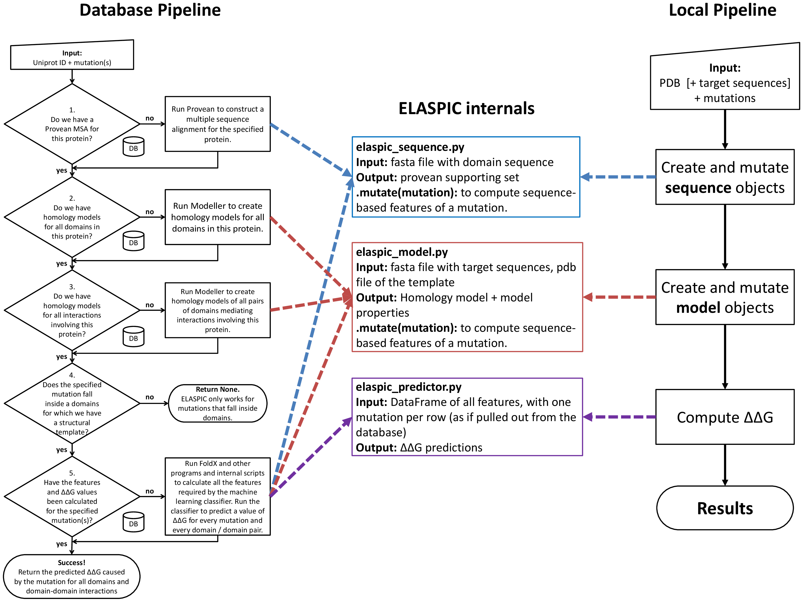

.. _introduction:

Introduction
============

   Flowchart describing the ELASPIC pipeline.

ELASPIC can be run using two different pipelines: the :ref:`local pipeline` and the :ref:`database pipeline`.

.. _`database pipeline`:

Database pipeline
-----------------

.. only:: html

   .. sidebar:: Database pipeline flowchart.

      .. image:: introduction/elaspic_flowchart_database.*
         :target: _downloads/elaspic_flowchart_database.pdf
         :width: 150 px
         :align: center

.. only:: latex

   .. image:: introduction/elaspic_flowchart_database.pdf
      :scale: 40
      :align: center

The database pipeline allows mutations to be performed on a proteome-wide scale, without having to specify a structural template for each protein. This pipeline requires a local copy of :ref:`ELASPIC domain definitions and templates <precalculated_data>`, as well as a local copy of the :ref:`BLAST and PDB databases <external_data>`.

The general overview of the database pipleine is presented in the :download:`figure <./introduction/elaspic_flowchart_database.pdf>` to the right. A user runs the ELASPIC pipeline specifying the Uniprot ID of the protein being mutated, and one or more mutations affecting that protein. At each decision node, the pipeline queries the database to check whether or not the required information has been previously calculated. If the required data has not been calculated, the pipeline calculates it on the fly and stores the results in the database for later retrieval. The pipeline proceeds until homology models of all domains in the protein, and all domain-domain interactions involving the protein, have been calculated, and the :math:`\Delta \Delta G` has been predicted for every specified mutation.

.. _`local pipeline`:

Local pipeline
--------------

.. only:: html

   .. sidebar:: Local pipeline flowchart.

      .. image:: ./introduction/elaspic_flowchart_local.*
         :target: _downloads/elaspic_flowchart_local.pdf
         :width: 100 px
         :align: center

.. only:: latex

   .. image:: ./introduction/elaspic_flowchart_local.pdf
      :scale: 40
      :align: center

The local pipeline works without downloading and installing a local copy of the ELASPIC and PDB databases, but requires a PDB structure or template to be provided for every protein. Pipeline output is saves as *JSON* files inside the working directory, rather than being uploaded to the database as in the case of the database pipeline. The general overview of the local pipleine is presented in the :download:`figure <./introduction/elaspic_flowchart_local.pdf>` to the right.

The local pipeline still requires a local copy of the :ref:`BLAST` nr database.
